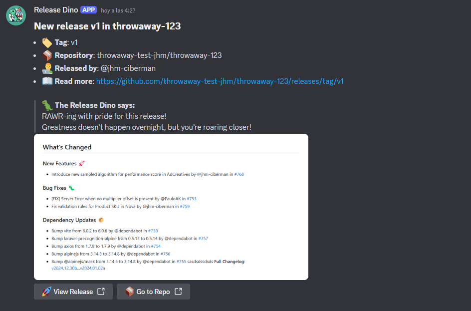

# Release Dino 

Release Dino is a simple discord bot that notifies you when a new release is out for any repository of your organization.

## Requirements

- Node 22 or higher
- A Discord bot token
- A github organization
- A VPS server with a public IP address or domain that is accessible from the internet

